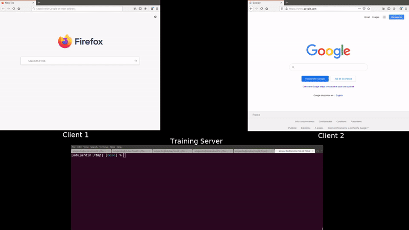

# Training supervisor

<p align="center">
    <a href="preview/video_preview.mp4">
    
    </a>
</p>

Heavily compressed gif preview in operation, [full video here](preview/video_preview.mp4).

The 2 clients have full control over the server and are sending commands on the same terminal while beeing on separate machines on the same network.

## Use case

- Watch and control the training process launched from a terminal without having to plug a monitor on the training server
- Tensorboard is nice but not enough to actually control the process, it only *reports* the information.

### Why ? 

The current alternatives solutions are :

- SSH: inconvenient since I need to be able to close the terminal/reboot whatever without stopping the training
- Jupyter notebooks: can't close and reopen, the training will continue but without any log or control
- Bash with GUI: need screen and GUI. It requires physically going to the training server to check the status


### Solution 

-> Start a process and connect from a browser to a *unique* bash using [ttyd](https://github.com/tsl0922/ttyd) and `tmux`. 
Every client connects to the **same** bash (it support authentication). This means anybody can watch and control simultaneously the process/terminal (with the output) without restrictions, such as closing the window...


### Note

My use case consists of a local network with multiple machines, the training servers running Ubuntu and the workstations. Although a VPN makes it very convenient to check on the training process remotely (outside the LAN).

The assumption is that the training server is pingable from the clients (and 1 training == 1 server).


## Setup (server side)

### Steps

No setup required on the client-side, only on the training server :

1. Install from source ttyd 

```bash
sudo apt-get install cmake g++ pkg-config git vim-common libwebsockets-dev libjson-c-dev libssl-dev
git clone https://github.com/tsl0922/ttyd.git
cd ttyd && mkdir build && cd build
cmake ..
make && make install
```

2. Install tmux

```bash
sudo snap install tmux --classic
```

3. Start (manually or automatically at boot) :

```bash
TTYD_PORT=4563
TTYD_USER="user"
TTYD_PORT="passwd"
TTYD_CMD="login" # can also be 'bash' or whatever command

ttyd -p ${TTYD_PORT} -c ${TTYD_USER}:${TTYD_PORT} tmux new -A -s ttyd ${TTYD_CMD}
```

The authentication is optional but recommended.

### Setup script

Alternatively the [setup.sh](setup.sh) script can be used to install the required dependencies and register a systemd service to start at boot. I recommend updating [the service file](training-supervisor.service) before setting it up since the user, password, and port are hardcoded as an example.

## Usage

On the client(s) open a browser to the machine IP or name like: `http://training-server-name:4563/`

Enter the authentication if needed (the first time) and that's it!
